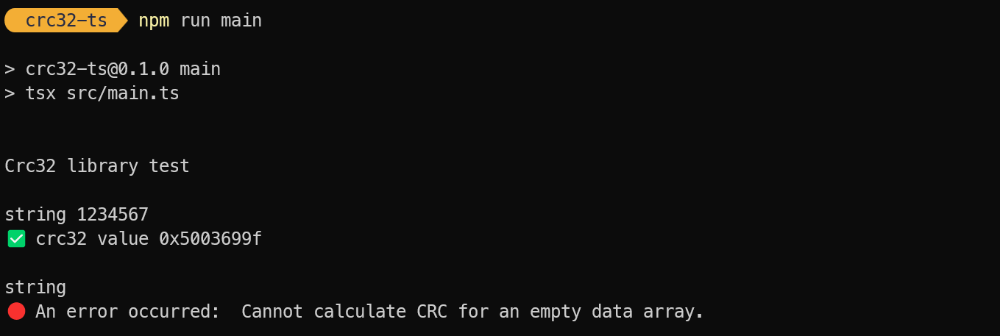
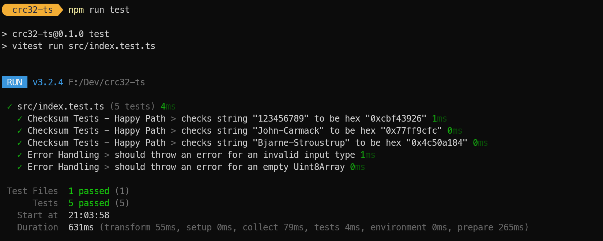

<p align="center">
  
</p>
<br/>

# crc32-ts

Crc32 (cyclic redundancy check) in TypeScript with typed arrays.

## Overview

`crc32-ts` is a small, well-typed TypeScript implementation of the CRC-32 checksum algorithm. It provides a compact, dependency free API for computing CRC-32 values in both Node and browser environments, with tests and examples included.





## Tech Stack

- 🔷 TypeScript
- 🟢 Node.js (for development and tests)
- 🧪 Vitest (unit tests)

## Dependencies

📦 No runtime dependencies.

## Features

- 🔬 Small, focused CRC-32 implementation in TypeScript
- 🌐 Zero native bindings — runs in Node and browser
- 📝 Type definitions included
- 🧪 Unit tests using Vitest

## Installation

From the project root:

```pwsh
# install dependencies
npm install

# compile TypeScript to `./dist`
npm run build

# create an ESM bundle with type declarations in `./dist`
npm run bundle
```

If you prefer Yarn or pnpm, use the equivalent install command for your package manager.

## Usage (ESM)

After running `npm run bundle` you can import the ESM build from `dist`:

```js
import { Crc32 } from './dist/index.js';

const crc = new Crc32();
const encoder = new TextEncoder();
const arr = encoder.encode('hello world');
console.log('0x' + crc.calculateCrc(arr).toString(16));
```

Run the included smoke test to verify the built bundle:

```pwsh
npm run smoke
```

## Usage


## License

Please check the [`LICENSE`](LICENSE) file.

## Links

* [Wikipedia: Cyclic redundancy check](https://en.wikipedia.org/wiki/Cyclic_redundancy_check)
* [CRC32 Demystified](https://github.com/Michaelangel007/crc32)

## History

* 16th August, 2025: refactor, more tests, bundling, scripts and CI workflow.
* 15th August, 2025: initial version.